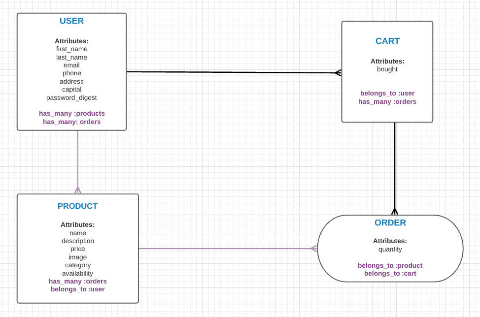

# SnapUpy API

This repository is the database for the fictious site snapUpy. This API is sending and receiving data with the use of routes, serializers and controllers.  
 

## Features
<li> Built with linear direction on the relationships and model associations with Serializers </li>
<li> Active Record Associations with has_many belongs_to and has_many :throught </li>
<li>The use of Cloudinary to upload images </li>

## Domain Model 

## Tech Stacks 
<li>Ruby on rails '2.6.1' </li>
<li>Rails as an API</li>
<li>PostgreSQL</li>
<li>Active Record </li>

## Gems 
<li>rack-rocks </li>
<li>active_model_serializers</li>
<li>jwt </li>
<li> bcrypt</li>

## Build Status
Working process.  
The core functionalities are there, but they have room for improvements.

## Set-up for running this application locally
This repository serves only as the database for the SnapUpy site, labeled as repository shopify-React-FE-Backend-Assesment 
 

<li>Clone this repository into your local computer</li>
<li>cd into the repository you just cloned and run bundle install in the command line to ensure all the gems are set in your local system</li>
<li>run rails db:create, rails db:migrate, rails db:seed</li>
<li>The last step will be to run 'rails s' in the command line to deploy the server in test mode in your local computer</li>

## Take Aways from this project
This is a fun project, where there is flexibility to build more.
